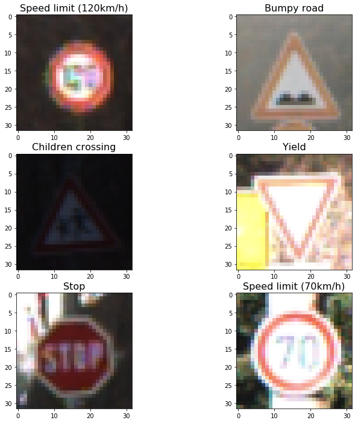
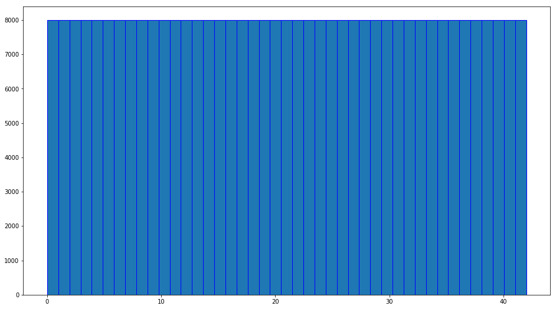

## Project: Build a Traffic Sign Recognition Program

Overview
---
This project is an implementation of Traffic Sign Recognition using Convolutional Neural Networks. 
* The German Traffic Sign image database is located [here](http://benchmark.ini.rub.de/?section=gtsrb&subsection=dataset). 
* The Ipython notebook is located [here](/Traffic_Sign_Classifier.ipynb). 
* HTML version of .ipynb file is located [here](/Traffic_Sign_Classifier.html).

Data Set Exploration
---
The data set is imported by loading the pickle (*.p) files. 
The data set contains training, validation and test data. 

Using numpy, we can get a basic summary of the data 
```import numpy as np
# TODO: Number of training examples
n_train = np.size(X_train,0)
# TODO: Number of testing examples.
n_test = np.size(X_test,0)

# TODO: What's the shape of an traffic sign image?
image_shape = str(np.size(X_train,1))+' x '+str(np.size(X_train,2))

# TODO: How many unique classes/labels there are in the dataset.
n_classes = np.size(np.unique(y_train),0) #done

print("Number of training examples =", n_train)
print("Number of testing examples =", n_test)
print("Image data shape =", image_shape)
print("Number of classes =", n_classes)
```

Here is the output of the code above looks 
```
Number of training examples = 34799
Number of testing examples = 12630
Image data shape = 32 x 32
Number of classes = 43
```
We have 34799 samples of images in the training dataset. 

Taking a Deep dive in data set
---
Lets look at six random images from the training data set. 
The sign names are imported into an array from the csv file. 
The appropriate sign name is then added as the title of the given image. 



We will now try to identify the distribution of the sample images in training data set. 


The above histogram shows that the samples are not uniformly distributed. Some labels have too many samples and some have very few. 
This could cause the network to have less accuracy since enough samples are not available to train. 

```
unique_labels, unique_count = np.unique(y_train, return_counts=True) #done
y_index=[]
for idx, val in enumerate(unique_count):
    if val <= 3000:
        print(idx,val)
        y_index = np.append(y_index,np.where(y_train==int(idx))) 
```

This code section will return the number of samples for each label. 
```
0 180
1 1980
2 2010
3 1260
4 1770
5 1650
6 360
7 1290
8 1260
9 1320
10 1800
11 1170
12 1890
13 1920
14 690
15 540
16 360
17 990
18 1080
19 180
20 300
21 270
22 330
23 450
24 240
25 1350
26 540
27 210
28 480
29 240
30 390
31 690
32 210
33 599
34 360
35 1080
36 330
37 180
38 1860
39 270
40 300
41 210
42 210
``` 
As seen from the output, some labels have as little as 180 sample images (label 0), while some have as many as 1860 (label 38)

Data Augmentation
---
The original data set channeled through a neural network resulted in poor accuracy ~89%. Changing the layers, hyper parameters, pre-processing techniques, resulted in minor improvements in accuracy. It seemed the network won't train well on the data set if it doesn't contain enough samples. To make the training data set more uniform, the following code section augments the images, and appends them to the original data. 
 
```
new count = 8000
while count of each label is less than new count
	randomly pick 1 to 5
	1. rotate the image
	2. translate the image
	3. add noise
	4. blur the image
	5. perform all of the above 
append new image to training data set, also append correct label 
end while loop
```
This while loop will append augmented images to the original data set until all labels have 8000 images.
This ensures the data is uniformly distributed, further the noise, translation, blurring and rotation helps in making the model robust.



As seen from the above distribution we have modified the distribution of the original data set. We have also increased the number of samples by approximately 10 times. 

```
Original number of samples in training data: 34799
Number of samples in training data after adding augmented images: 344043
```
Step 2: Design and Test a Model Architecture
---
### Pre-process the Data Set (normalization, grayscale, etc.)
Preprocessing is done by converting the 3 channel image to 1 channel (gray scaling).
The following function was used to conver the colored image to gray scaled. 

```
def rgb2gray(rgb):
    return np.dot(rgb[...,:3], [0.299, 0.587, 0.114]).reshape((np.size(rgb,0),32,32,1))
```
### Model Architecture

Layer 1: Convolutional. Input = 32x32x1 Output = 30x30x32

Layer 2: Convolutional. Input  = 30x30x32 Output = 28x28x32

Pooling. Input =28x28x32. Output = 14x14x32

Layer 3: Convolutional. Iutput = 14x14x32 Output = 12x12x64

Layer 4: Convolutional. Iutput = 12x12x64 Output = 10x10x64

Pooling. Input = 10x10x64. Output = 5x5x64

Layer 5: Convolutional. Iutput = 5x5x64 Output = 3x3x128

Flatten. Input = 3x3x128. Output = 1152

Layer 6: Fully Connected. Input = 1152. Output = 1024

Layer 7: Fully Connected. Input = 1024. Output = 1024

Dropout (0.65)

Layer 8: Fully Connected. Input = 1024. Output = 43

Dropout keep_prob: 0.65
Batches: batch_size : 128
Epochs : 10

Hyperparameters : 
mu = 0, sigma = 0.1 for weight initialization,
Learning rate = 0.001

Optimizer:
Adam Optimzer

```
############################################################################
from datetime import datetime
############################################################################
with tf.Session() as sess:
   sess.run(tf.global_variables_initializer())
   num_examples = len(X_train)
   
   print("Training...")
   startTime = datetime.now()
   print()
   for i in range(EPOCHS):
       startTime = datetime.now()
       X_train, y_train = shuffle(X_train, y_train)
       for offset in range(0, num_examples, BATCH_SIZE):
           end = offset + BATCH_SIZE
           batch_x, batch_y = X_train[offset:end], y_train[offset:end]
           sess.run(training_operation, feed_dict={x: batch_x, y: batch_y, keep_prob:0.65})
       validation_accuracy = evaluate(X_valid, y_valid)
       print("EPOCH {} ...".format(i+1))
       print("Validation Accuracy = {:.3f}".format(validation_accuracy))
       print(str((datetime.now() - startTime).total_seconds()) + ' secs')
       print()

   saver.save(sess, './garys_nn.ckpt')
   print("Model saved")
```
The above code was used to train the network 

```
Training...
.
..
...
....
EPOCH 10 ...
Validation Accuracy = 0.981
525.860487 secs

Model saved
```
Validation accuracy is fairly high (~98%)
All parameters were changed to achieve highest possible validation accuracy. 
Once  all code was in place to improve robustnessand  the accuracy was sufficiently high (> 95%), the model was saved.

### Test Accuracy
```
############################################################################
from datetime import datetime
############################################################################
with tf.Session() as sess:
    #saver.restore(sess, tf.train.latest_checkpoint('.'))
    #saver = tf.train.import_meta_graph('gary_nn.meta')
    #saver.restore(sess,tf.train.latest_checkpoint('./'))
    saver.restore(sess,'./garys_nn.ckpt')
    test_accuracy = evaluate(X_test, y_test)
    print("Test Accuracy = {:.3f}".format(test_accuracy))
```
The testing accuracy was ```0.955``` which seems fairly high and close to the human accuracy of ```0.988```[1]

[1] Sermanet, P., & LeCun, Y. (2011, July). Traffic sign recognition with multi-scale convolutional networks. In Neural Networks (IJCNN), The 2011 International Joint Conference on (pp. 2809-2813). IEEE. Chicago

#####################################################################################################################################################################
A great writeup should include the [rubric points](https://review.udacity.com/#!/rubrics/481/view) as well as your description of how you addressed each point.  You should include a detailed description of the code used in each step (with line-number references and code snippets where necessary), and links to other supporting documents or external references.  You should include images in your writeup to demonstrate how your code works with examples.  

All that said, please be concise!  We're not looking for you to write a book here, just a brief description of how you passed each rubric point, and references to the relevant code :). 


The Project
---
The goals / steps of this project are the following:
* Load the data set
* Explore, summarize and visualize the data set
* Design, train and test a model architecture
* Use the model to make predictions on new images
* Analyze the softmax probabilities of the new images
* Summarize the results with a written report
#####################################################################################################################################################################

### Dependencies
This lab requires:

* [CarND Term1 Starter Kit](https://github.com/udacity/CarND-Term1-Starter-Kit)

The lab environment can be created with CarND Term1 Starter Kit. Click [here](https://github.com/udacity/CarND-Term1-Starter-Kit/blob/master/README.md) for the details.

### Dataset and Repository

1. Download the data set. The classroom has a link to the data set in the "Project Instructions" content. This is a pickled dataset in which we've already resized the images to 32x32. It contains a training, validation and test set.
2. Clone the project, which contains the Ipython notebook and the writeup template.
```sh
git clone https://github.com/udacity/CarND-Traffic-Sign-Classifier-Project
cd CarND-Traffic-Sign-Classifier-Project
jupyter notebook Traffic_Sign_Classifier.ipynb
```
